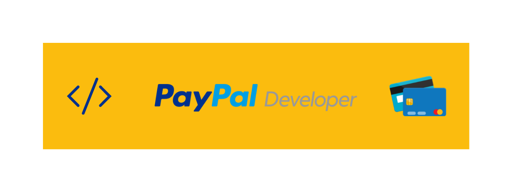

  <h1>PayPal Developer</h1>
  
   
  <a href="https://twitter.com/paypaldev" target="_blank">Twitter</a>
    &nbsp;&nbsp;•&nbsp;&nbsp;
  <a href="https://www.paypal.com/us/home" target="_blank">PayPal</a>
    &nbsp;&nbsp;•&nbsp;&nbsp;
  <a href="https://developer.paypal.com/home" target="_blank">Docs</a>
    &nbsp;&nbsp;•&nbsp;&nbsp;
  <a href="https://github.com/paypaldev" target="_blank">Examples</a>
    &nbsp;&nbsp;•&nbsp;&nbsp;
  <a href="https://dev.to/paypaldeveloper" target="_blank">Blog</a>
   
  

# 👋 Hello PayPal Developers!

Paypal is a payment processing product that helps you process payments for your mobile and web applications. We provide a fast and easy way to handle online payments, whether it's for a digital media property or an online merchant of any kind in over 100 countries.

At PayPal, we support different technologies trough our SDKs and our REST  & GraphQL API endpoints.

# 🖥️ Sample Apps

PayPal provides code repositories through two GitHub Organizations:

- Official PayPal SDKs are available through [PayPal GitHub](https://github.com/paypal) organization.

- Sample Applications are available through the [PayPal Developer GitHub](https://github.com/paypaldev) organization.

# 🤠 Developer Community

Get in touch with us or learn more about OneSignal through the channels below.

- [Follow us on Twitter](https://twitter.com/paypaldevs).
- [PayPal Blog](https://dev.to/paypaldeveloper).
- [Subscribe to our on YouTube Channel](https://www.youtube.com/channel/UCvNxReTAQudFN4RQth9r_6A/videos).

# 💼 Careers

We believe now is the time to reimagine money and democratize financial services, so that managing and moving money is safe and accessible for everyone. Want to learn more? Visit [PayPal Careers](https://careers.pypl.com/home/) to learn more.
